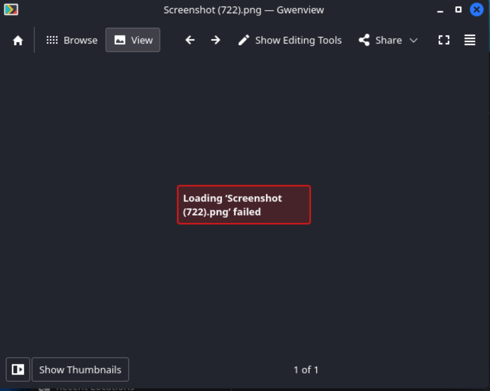
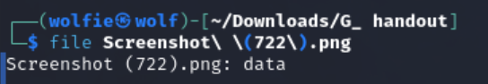
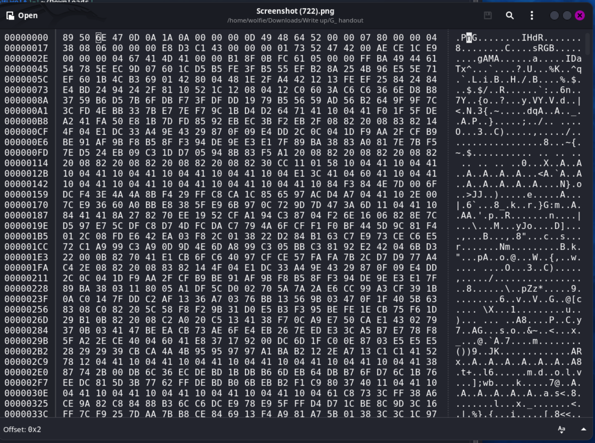
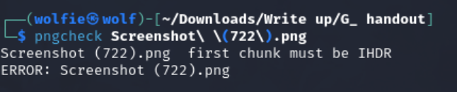
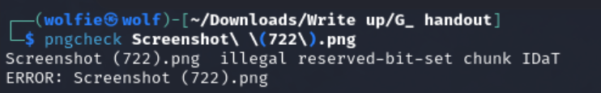
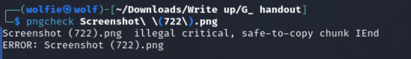
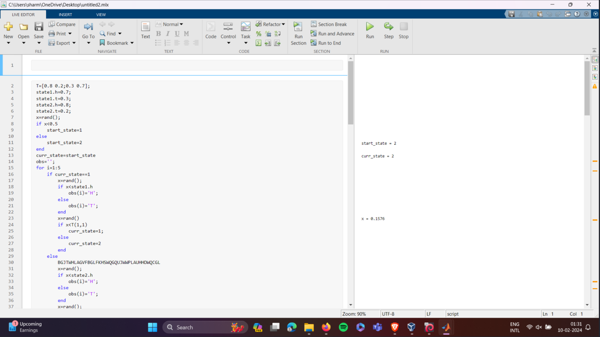

## G handout --(100 points)
Download the file `G_handout-20240213T184008Z-001.zip` Extracting it reveals the following:
├── G_handout
    └── Screenshot (722).png
 
 Lets check `Screenshot (722).png`:
 - `cd` into the directory where the file is downloaded
 - when we open the image we get and error

 

- in terminal use `file Screenshot (722).png` we will get:

  

- Open Ghex or HexEdit to view the png magic numbers 
Syntax for running Ghex is:
`ghex <file_name>`

-Notice the first line PNG magic number is `89 50  4E 47`,but this file has `89 50 6E 47`, make changes accordingly and save it....
- Now "pngcheck" the image file to know further errors in the image 
Syntax is `pngcheck <file_name>`
- we get the following error:

- To correct this open Ghex/HexEdit and find the IHDR chunk  and change it from `IHdR` to `IHDR`, save it and `pngcheck` it again
- We get another error but this time related to the `IDAT` chunk

- 

- 
- Open Ghex and correct the chunk from `IDaT` to `IDAT`
`pngcheck` the image again we receive the same error i.e related to `IDaT` chunk
- Open Ghex using the hotkey `ctrl+f` search for the chunk `IDaT` and replace all of them to `IDAT`
- `pngcheck` the image again u will get a different error this time related to the `Iend` chunk
change `Iend` to `IEND` and save the file
- 

  
- Open the image u will find 

-In this Matlab Screenshot u will find a cipher `BGJTWHLAGVFBGLFKHSWQGQUJWWPLAUHHDWQCGL`

To find out which cipher you can check out [Dcode](https://www.dcode.fr/cipher-identifier)
-After analyzing u will know this is Cipher is Fractionated Morse Cipher
AFTER decoding the u will get `FLAGGHEXFRACTIONATEDMORSEENCODER`
change according to the Flag format

-The flag is `FLAG{GHEXFRACTIONATEDMORSEENCODER}`
